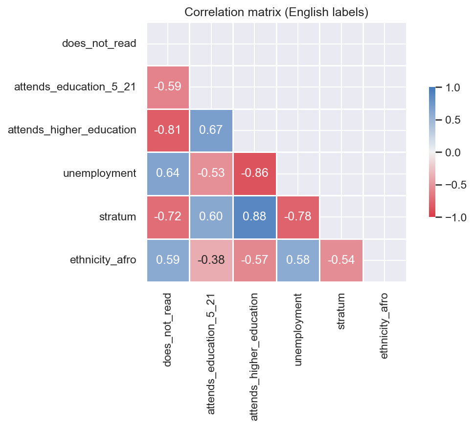
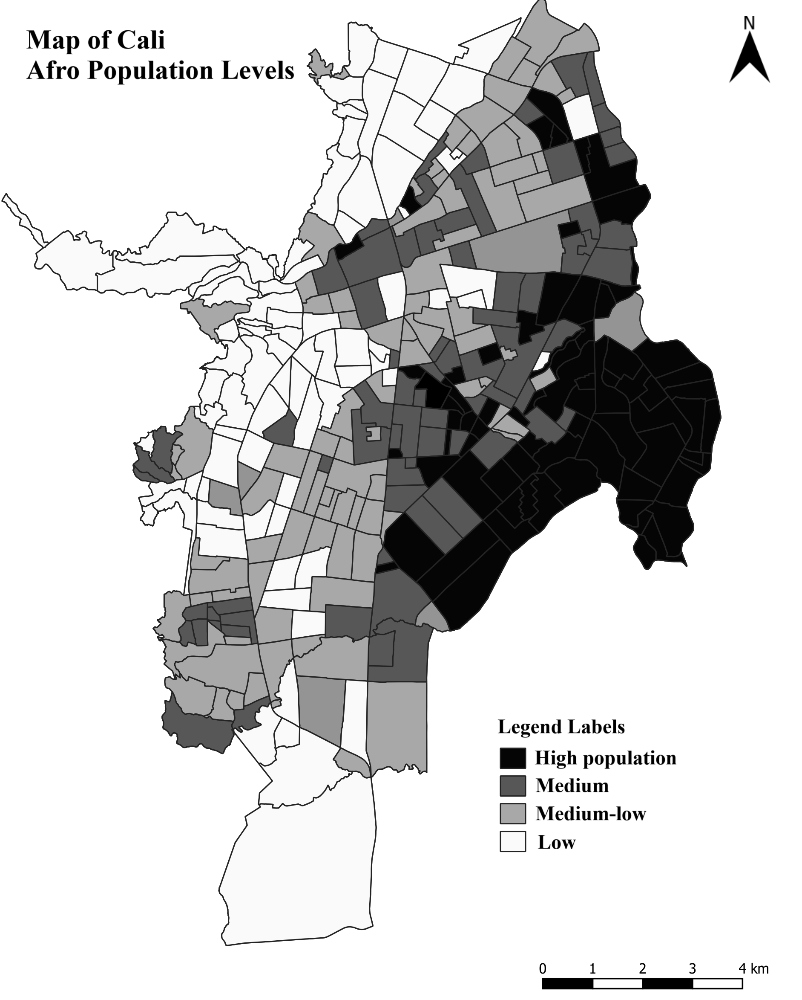
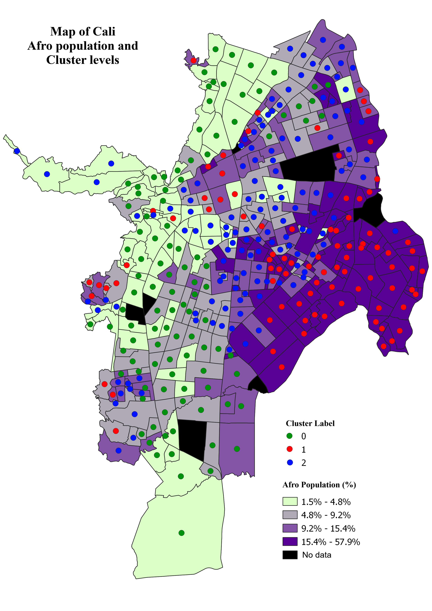

# Blackpolis: Systematic Racism in Cali

**Decision-maker:** Vice Minister of Equity, Secretary of Equity in Cali.
**Brief problem:** Reducing the inequality gap from labor and educational sectors in Afro communities in Cali.
**By:** Daniel Navarro

> **Executive Summary**
>
> This policy brief provides a quantitative analysis of the socioeconomic gap of Afro communities in Cali in terms of work and education. The brief explores geographical segregation while suggesting three courses of action: status quo, promoting education, and promoting employment, with an overview of the best options based on effectiveness, administrative feasibility, and efficiency. The findings reveal that the best option is to initiate programs for labor introduction and personal finances in the most unequal neighborhoods.

---

## Problem Statement

Around the country there is a visible socioeconomic gap between Afro communities and the rest of the people. Chocó, the department with the largest population of people who self-identify as Black, is the poorest and has the highest inequality gap. This same phenomenon is seen in Cali, the city with the third largest Afro population in Latin America. These communities are concentrated in Aguablanca District and other ethnic mestizo sectors such as Siloé; sectors that also have the lowest socioeconomic status. This policy brief examines two key areas for socioeconomic status — unemployment and education — and proposes solutions to reduce the gap in these areas.

Education and employment are strongly linked: better income usually leads to better education, and better education provides wider ranges of employability. Hence, these two areas are critical for reducing the socioeconomic inequality gap with Afro communities.

A statistical approach helps assess current conditions across the city and understand the distribution of Afro communities. Data helps target policies and understand the magnitude of the issue. In this case, the main data source is the 2018 national census and CaliEnDatos, with neighborhood-level information for ethnicity, socioeconomic status[^1], education, literacy, and unemployment. Ethnicity percentage (NARP population) serves as the independent variable, allowing us to test whether systemic discrimination drives lower employment and education outcomes.

[^1]: In Colombia there is a socioeconomic system to divide the socioeconomic status of the population, which helps define how government aids are distributed. These are called *Estratos* (stratum), and go from 1 to 6.

The correlation matrix (**Figure 1**) offers an initial overview: higher illiteracy and unemployment coincide with greater Afro-Colombian presence, while school and university attendance decline as ethnic representation rises. Lower socioeconomic strata also align with higher Afro population. These patterns reflect discrimination documented in the literature, and regression analysis reinforces this trend.

**Figure 1.** Correlation matrix of socioeconomic indicators and Afro ethnicity share.



A regression analysis (**Table 1**) reveals a consistent and statistically meaningful relationship between ethnic composition and key socioeconomic indicators. Specifically, the slope of **0.30** in the *Ethnicity–Unemployment* model indicates that areas with higher proportions of Afro-descendant population tend to experience higher unemployment rates. Conversely, the negative slopes for education variables suggest an inverse association: a slope of **–0.548** for *Attends Education (ages 5–21)* and **–1.09** for *Attends Higher Education* imply that greater ethnic representation is linked to lower school attendance and reduced access to higher education. Finally, the positive slope of **0.10** for *Does Not Read (%)* suggests a slight increase in illiteracy rates as ethnic representation rises. These patterns underscore the structural disparities affecting Afro-descendant communities, particularly in employment and educational attainment.

**Table 1.** Regression results.

| X Variable | Y Variable                  | Slope  | Intercept |
| ---------- | --------------------------- | ------ | --------- |
| Ethnicity  | Unemployment                | 0.30   | 0.16      |
| Ethnicity  | Attends Education (5–21)    | −0.548 | 0.71      |
| Ethnicity  | Attends Higher Education    | −1.09  | 0.44      |
| Ethnicity  | Does Not Read (%)           | 0.10   | 0.015     |

While correlations and regressions reveal inequality, human interpretation alone can miss patterns critical for policy design. That is why clustering models are introduced — to help visualize how neighborhoods can be grouped by similar conditions, making geographic disparities more evident and allowing focused policies. Using attributes such as unemployment, literacy, and education, the model divides Cali into three clusters. In this case, we group by using exclusively the attributes that compose socioeconomic status: *Unemployment*, *Attends Education (ages 5–21)*, *Attends Higher Education*, and *Does Not Read (%)*. This separates the city into brackets that can be explored to understand how ethnicity behaves inside each one.

**Table 2.** Mean values of each attribute by cluster.

| Cluster | Ethnicity (Afro) | Unemployment | Does Not Read (%) | Attends Higher Education | Attends Education (5–21) |
| ------- | ---------------- | ------------ | ----------------- | ------------------------ | ------------------------ |
| 0       | 0.0592           | 0.1418       | 0.0131            | 0.5468                   | 0.7679                   |
| 1       | 0.2122           | 0.2374       | 0.0466            | 0.1282                   | 0.5115                   |
| 2       | 0.0991           | 0.2113       | 0.0266            | 0.2584                   | 0.6540                   |

Table 2 reveals the behavior of each cluster. **Cluster 0** shows relatively low Afro-Colombian representation (around 6%), moderate unemployment (14%), and strong educational outcomes, with over 54% attending higher education and nearly 77% enrolled in basic education — mainly higher-income neighborhoods around Calle Quinta. **Cluster 1**, in contrast, exhibits the highest Afro-Colombian presence (21%) and the most disadvantaged outcomes: unemployment reaches 24%, illiteracy is more prevalent, and access to higher education is extremely limited (only 13%). Attendance in basic education is also lower (51%). **Cluster 2** falls between these extremes and represents middle-class neighborhoods and other mestizo communities.

Based on these findings, this brief offers three courses of action to reduce the inequality gap by promoting work and/or education. The first is the status quo (inaction), the second is to address education first, and the third is to address employment. The best course of action will be suggested based on its effectiveness, administrative feasibility, and efficiency. All three are scored qualitatively from 0 to 10, with 10 being the best, for a maximum of 30 points for a perfectly effective, administratively feasible, and efficient solution.

- **Effectiveness** is scored based on the likelihood of achieving long-term goals (5 points) and the probability of addressing related issues (5 points).
- **Administrative feasibility** is scored as follows: *Current Institutions*, up to 5 points if there are institutions that could implement the program; *Institutional Capacity*, up to 3 points if the institution has the capacity to implement the program; *Institutional Budget*, up to 2 points if the institution has a specific budget for this type of program.
- **Efficiency** is scored based on return on investment in the form of taxes and added social value. 10 would be a program that drastically promotes social mobility and brings additional tax revenue from increased wages; 0 a program that does not achieve anything.

## Courses of Action

### 1. Status Quo

Inaction is a form of policy. Current programs are working slowly but working somehow. Keeping things as they are is an option.

- **Effectiveness:** 3 points. Current programs minimally address the matter and affect the objective at least a bit.
- **Administrative feasibility:** 10 points. No additional institutional requirements; already running.
- **Efficiency:** 5 points. It is halfway efficient to obtain at least minimum results without doing anything.
- **Total:** 18 points.

### 2. Educational Programs

The most critical issue is the high amount of illiteracy in the area. Initially, programs to teach people how to read are fundamental. The communal buildings and the *juntas* are perfect places to initiate these programs. Moreover, if such a program can start, the proposed approach would include an alliance with SENA to also provide trades education. SENA is already the biggest educational institution in the country, and this follows its goal. Taking specific short training courses to the Cluster 1 neighborhoods would help tackle educational lag and promote the reduction of the inequality gap.

- **Effectiveness:** 7 points. Education in the long run improves the quality of life for people.
- **Administrative feasibility:** 8 points. SENA already exists and has the capacity, but it does not have the specific budget — it would require an alliance with a financing institution.
- **Efficiency:** 6 points. It is rather costly to promote these programs and hard to get people to enroll. The return is mainly social, as it does not necessarily ensure better wages or jobs. Hence the return is positive but not great.
- **Total:** 21 points.

### 3. Labor Introduction Programs

Tackling the job market and promoting formal employment would increase tax revenue for the municipality, while allowing families to grow and provide better education for their children (effectively reducing the gap on *Attends Education (5–21)*). The program would focus on introducing people to CV building, soft skills for employment, personal finances, and job searching techniques. With help from Cali's Chamber of Commerce a labor promotion program could be set up — even more so if it includes the participation of recruiting companies interested in recruiting and developing skills for non-technical jobs.

- **Effectiveness:** 9 points. Better jobs in the long run improve quality of life and provide access to education, health, and many other socioeconomic factors.
- **Administrative feasibility:** 6 points. The Chamber of Commerce exists but has neither the capacity nor the budget to implement this program, hence it would require additional alliances.
- **Efficiency:** 8 points. It is not too costly to promote this program, and returns ensure better wages and better jobs. Hence the return is highly positive for the municipality and the people.
- **Total:** 23 points.

## Policy Recommendation

Education and labor are deeply correlated. Both tend to lead to better outcomes: educational basics open the job market, while higher salaries tend to lead to higher educational achievement. Hence, tackling either will contribute to the overall well-being of the communities. However, the best option to contribute to general well-being, long-term goals, administrative feasibility, and efficiency is a program to promote labor and personal finances.

Improving personal finances with adequate training and allowing people to enter the formal market will lead to more sustainable development: higher educational achievement, higher wages, and more taxes for the city. For all the above, the suggested course of action is to **initiate a program to promote formal employment, labor lookup training, and personal finances in the Cluster 1 neighborhoods**, as it will effectively tackle education and unemployment and reduce the inequality gap in the city.

---

## Annexes

### Annex 1. Afro population levels in Cali



### Annex 2. Cluster assignments overlaid on Afro population levels



---

## References

- Alves, J. A. (2020). Biopólis, necrópolis, 'blackpolis': Notas para un nuevo léxico político en los análisis socio-espaciales del racismo. *Geopauta*, 4(1), 5. https://doi.org/10.22481/rg.v4i1.6161
- DANE (National Administrative Department of Statistics). (2018). *Censo Nacional de Población y Vivienda 2018.* https://microdatos.dane.gov.co/index.php/catalog/643
- DANE (National Administrative Department of Statistics). (2018). *Gran Encuesta Integrada de Hogares — GEIH.* https://microdatos.dane.gov.co/index.php/catalog/547

---

## Replication

This repository contains the data and code used to produce the analysis in this brief.

```
blackpolis_replication/
├── README.md                       # This document (the policy brief)
├── blackpolis_replication.ipynb    # Jupyter notebook with the full analysis
├── data/
│   ├── datamerge_clustered.csv     # Cleaned, merged neighborhood-level dataset
│   └── cluster_table.xlsx          # Cluster summary used in Table 2
└── figures/
    ├── correlation_matrix.png
    ├── afro_population_map.png
    └── cluster_with_afro_population.png
```

The original raw census extracts and the separate NARP file are not preserved; the analysis runs from the cleaned snapshot `data/datamerge_clustered.csv`.

### Requirements

Python 3.9+ and the following packages:

```bash
pip install numpy pandas matplotlib seaborn plotly scipy scikit-learn jupyter
```

### Running the notebook

```bash
jupyter notebook blackpolis_replication.ipynb
```

The notebook re-generates the correlation matrix figure into `figures/` on each run. The static QGIS maps in `figures/` are kept as-is.
